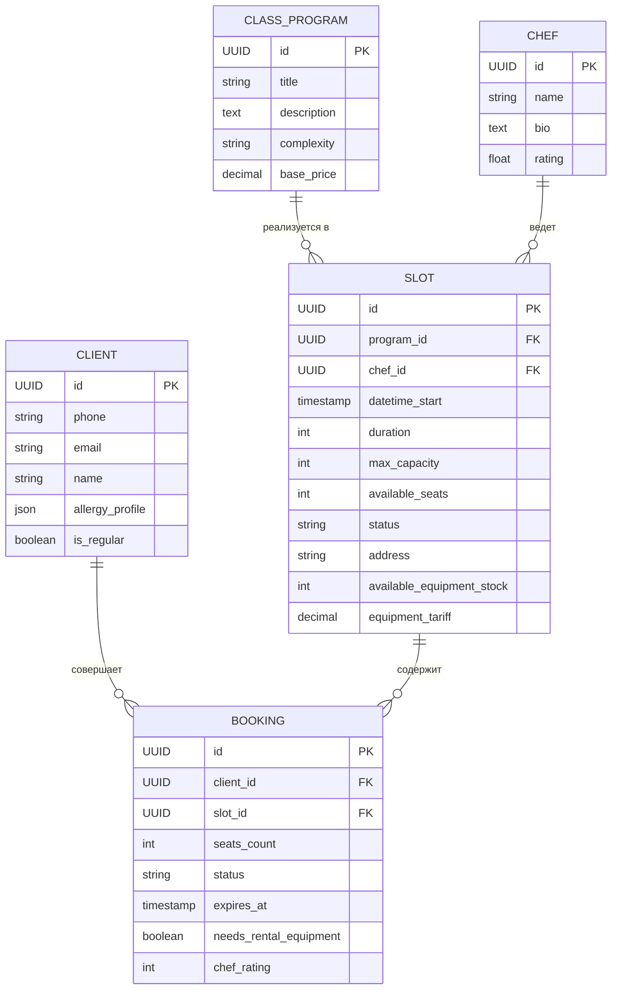

# Логическая ER-модель базы данных

В данном документе описана логическая модель данных системы в контексте клиентского мобильного приложения. Модель основана на [доменной модели](../1-elicitation/domain_model.md) и функциональных требованиях.

## 1. Описание сущностей и уровень доступа

Для каждой сущности определен уровень доступа со стороны мобильного приложения:
* **Read-Only**: данные приходят из внешнего бэкенда, мобильное приложение только отображает их.
* **Read / Write**: мобильное приложение может как считывать, так и создавать/изменять эти данные через API.

### 1.1 Client (Клиент)
Пользователь мобильного приложения, бронирующий кулинарные классы.
* **Уровень доступа:** **Read / Write** (Приложение обновляет имя при регистрации и теги аллергий в профиле).
* **Атрибуты:**
  * `id` (UUID, Primary Key) — уникальный идентификатор.
  * `phone` (String) — номер телефона для авторизации [FR-10](../2-requirements/functional-requirements.md).
  * `email` (String, Nullable) — email клиента.
  * `name` (String, Nullable) — имя пользователя [FR-15](../2-requirements/functional-requirements.md).
  * `allergy_profile` (JSON / Array of Strings) — список выбранных аллергенов [FR-25](../2-requirements/functional-requirements.md).
  * `is_regular` (Boolean) — флаг постоянного клиента (программа лояльности).

### 1.2 ClassProgram (Программа класса)
Шаблон кулинарного мероприятия (тема, меню, сложность).
* **Уровень доступа:** **Read-Only** (Создается и редактируется администраторами студии на бэкенде).
* **Атрибуты:**
  * `id` (UUID, Primary Key) — уникальный идентификатор.
  * `title` (String) — название программы.
  * `description` (Text) — подробное описание и состав меню.
  * `complexity` (String / Enum) — уровень сложности [FR-50](../2-requirements/functional-requirements.md).
  * `base_price` (Decimal) — базовая стоимость участия одного человека.

### 1.3 Chef (Шеф)
Кулинарный эксперт, который ведет класс.
* **Уровень доступа:** **Read-Only** (Рейтинг пересчитывается бэкендом, профили заводятся студией).
* **Атрибуты:**
  * `id` (UUID, Primary Key) — уникальный идентификатор.
  * `name` (String) — имя или псевдоним шефа.
  * `bio` (Text, Nullable) — краткая биография.
  * `rating` (Float) — общая средняя оценка шефа (на основе отзывов клиентов).

### 1.4 Slot (Слот расписания)
Конкретное проведение `ClassProgram` в заданное время с определенным `Chef`.
* **Уровень доступа:** **Read-Only** (Приложение только запрашивает расписание [FR-40](../2-requirements/functional-requirements.md). Свободные места и инвентарь пересчитываются бэкендом при бронировании).
* **Атрибуты:**
  * `id` (UUID, Primary Key) — уникальный идентификатор.
  * `program_id` (UUID, Foreign Key) — ссылка на ClassProgram.
  * `chef_id` (UUID, Foreign Key) — ссылка на Chef.
  * `datetime_start` (Timestamp) — дата и время начала класса.
  * `duration` (Integer) — продолжительность в минутах.
  * `max_capacity` (Integer) — общее число рабочих мест.
  * `available_seats` (Integer) — количество оставшихся мест [FR-50](../2-requirements/functional-requirements.md).
  * `status` (String / Enum) — статус (например, SCHEDULED, CANCELLED).
  * `address` (String) — адрес проведения.
  * `available_equipment_stock` (Integer) — доступный остаток прокатного инвентаря [FR-65](../2-requirements/functional-requirements.md).
  * `equipment_tariff` (Decimal) — стоимость аренды оборудования.

### 1.5 Booking (Бронирование)
Факт записи клиента на слот с опциональной арендой инвентаря.
* **Уровень доступа:** **Read / Write** (Приложение создает брони [FR-60](../2-requirements/functional-requirements.md), отменяет их [FR-85](../2-requirements/functional-requirements.md) и выставляет оценки [FR-100](../2-requirements/functional-requirements.md)).
* **Атрибуты:**
  * `id` (UUID, Primary Key) — уникальный идентификатор брони.
  * `client_id` (UUID, Foreign Key) — ссылка на Client.
  * `slot_id` (UUID, Foreign Key) — ссылка на Slot.
  * `seats_count` (Integer) — количество забронированных мест.
  * `status` (String / Enum) — текущий статус (PENDING_PAYMENT, ACTIVE, CANCELLED_BY_CLIENT, CANCELLED_BY_STUDIO, COMPLETED).
  * `expires_at` (Timestamp, Nullable) — время истечения брони (для статуса PENDING_PAYMENT) [FR-80](../2-requirements/functional-requirements.md).
  * `needs_rental_equipment` (Boolean) — признак аренды экипировки [FR-65](../2-requirements/functional-requirements.md).
  * `chef_rating` (Integer, Nullable) — оценка, выставленная шефу (от 1 до 5) [FR-100](../2-requirements/functional-requirements.md).

## 2. Связи (Relationships)

1. **Client (1) — (M) Booking**
   * Один `Client` может иметь множество `Booking` в истории.
   * `Booking` всегда принадлежит строго одному `Client`.

2. **Slot (1) — (M) Booking**
   * На один `Slot` могут быть зарегистрированы несколько клиентов через `Booking` (в пределах лимита `max_capacity`).

3. **ClassProgram (1) — (M) Slot**
   * Одна `ClassProgram` может планироваться множество раз как разные `Slot` в разные даты.
   * `Slot` реализует строго одну `ClassProgram`.

4. **Chef (1) — (M) Slot**
   * Один `Chef` может быть назначен на множество разных `Slot`.
   * Один `Slot` ведет ровно один `Chef`.

## 3. ER-диаграмма (Mermaid)

