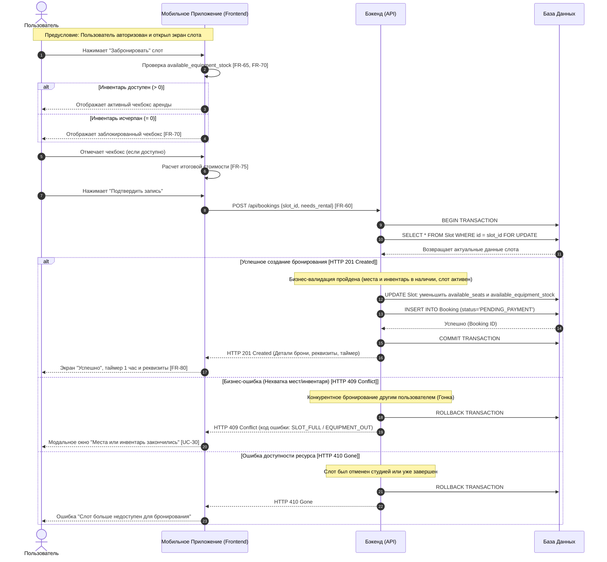

# Sequence-диаграмма: Создание бронирования

Данный документ описывает последовательность взаимодействия систем при создании бронирования на основе `[UC-30](../2-requirements/use-cases.md)`.

## 1. Описание процесса (Create Booking)

Процесс охватывает действия клиента с момента выбора слота до получения подтверждения о резерве места. Включает логику проверки доступности инвентаря `[FR-65](../2-requirements/functional-requirements.md)`, расчета стоимости `[FR-75](../2-requirements/functional-requirements.md)` и обработки возможных отказов от бэкенда (конкурентные транзакции, неактуальный статус слота).

## 2. Диаграмма последовательности (Mermaid)

## 3. Трассировка требований

Диаграмма явно опирается на следующие функциональные требования и прецеденты:
* Управление арендой экипировки в UI: `[FR-65](../2-requirements/functional-requirements.md)`, `[FR-70](../2-requirements/functional-requirements.md)`.
* Калькуляция итоговой суммы: `[FR-75](../2-requirements/functional-requirements.md)`.
* Создание записи: `[FR-60](../2-requirements/functional-requirements.md)`.
* Финальный экран с реквизитами: `[FR-80](../2-requirements/functional-requirements.md)`.
* Обработка гонки за ресурсы (409 Conflict): `[UC-30](../2-requirements/use-cases.md)` (Матрица ошибок).
* Обработка недоступного слота (410 Gone): дополнительный технический кейс недоступности ресурса.
